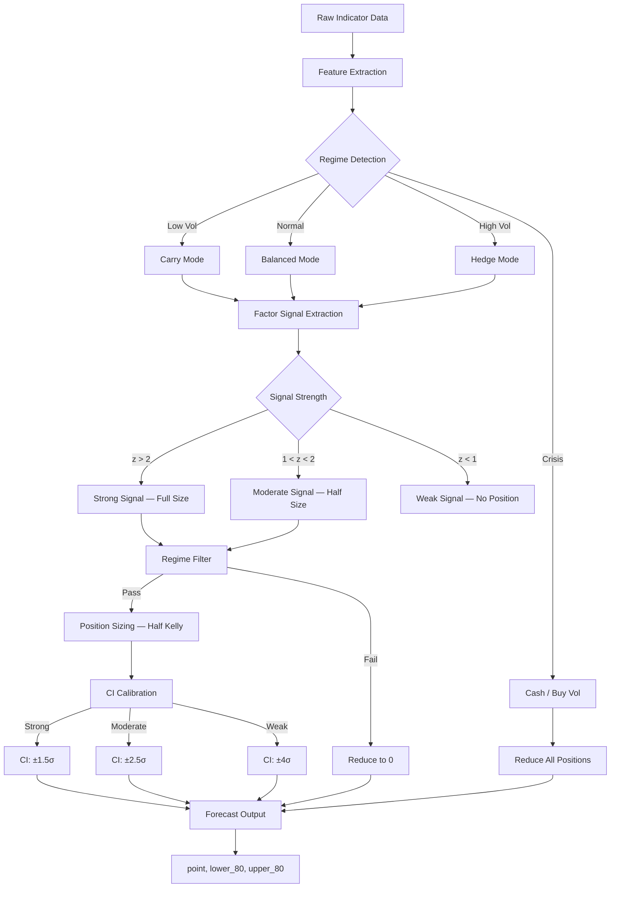

# Simons — Decision Flow

```mermaid
flowchart TD
    A[Raw Indicator Data] --> B[Feature Extraction]
    B --> C{Regime Detection}
    
    C -->|Low Vol| D[Carry Mode]
    C -->|Normal| E[Balanced Mode]
    C -->|High Vol| F[Hedge Mode]
    C -->|Crisis| G[Cash / Buy Vol]
    
    D --> H[Factor Signal Extraction]
    E --> H
    F --> H
    G --> I[Reduce All Positions]
    
    H --> J{Signal Strength}
    J -->|z > 2| K[Strong Signal — Full Size]
    J -->|1 < z < 2| L[Moderate Signal — Half Size]
    J -->|z < 1| M[Weak Signal — No Position]
    
    K --> N[Regime Filter]
    L --> N
    
    N -->|Pass| O[Position Sizing — Half Kelly]
    N -->|Fail| P[Reduce to 0]
    
    O --> Q[CI Calibration]
    Q -->|Strong| R[CI: ±1.5σ]
    Q -->|Moderate| S[CI: ±2.5σ]
    Q -->|Weak| T[CI: ±4σ]
    
    R --> U[Forecast Output]
    S --> U
    T --> U
    I --> U
    P --> U
    
    U --> V[point, lower_80, upper_80]
```
