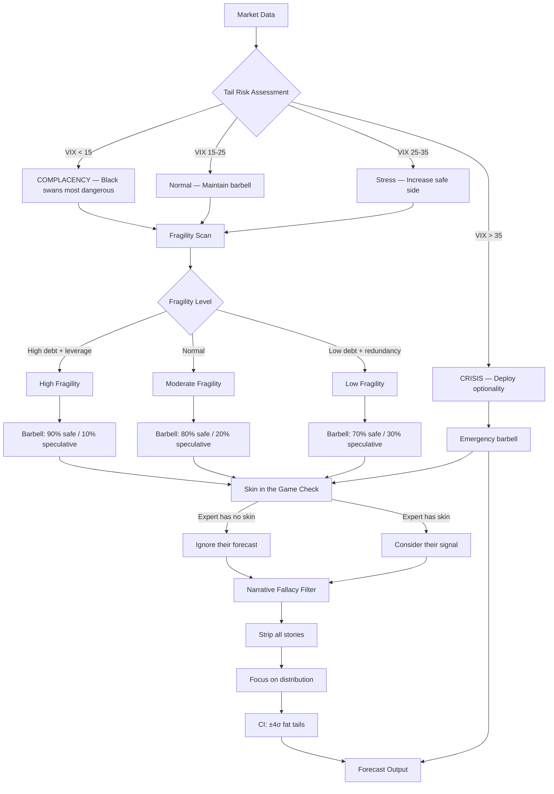

# Taleb — Decision Flow

```mermaid
flowchart TD
    A[Market Data] --> B{Tail Risk Assessment}
    
    B -->|VIX < 15| C[COMPLACENCY — Black swans most dangerous]
    B -->|VIX 15-25| D[Normal — Maintain barbell]
    B -->|VIX 25-35| E[Stress — Increase safe side]
    B -->|VIX > 35| F[CRISIS — Deploy optionality]
    
    C --> G[Fragility Scan]
    D --> G
    E --> G
    F --> H[Emergency barbell]
    
    G --> I{Fragility Level}
    I -->|High debt + leverage| J[High Fragility]
    I -->|Normal| K[Moderate Fragility]
    I -->|Low debt + redundancy| L[Low Fragility]
    
    J --> M[Barbell: 90% safe / 10% speculative]
    K --> M2[Barbell: 80% safe / 20% speculative]
    L --> M3[Barbell: 70% safe / 30% speculative]
    
    M --> N[Skin in the Game Check]
    M2 --> N
    M3 --> N
    H --> N
    
    N -->|Expert has no skin| O[Ignore their forecast]
    N -->|Expert has skin| P[Consider their signal]
    
    O --> Q[Narrative Fallacy Filter]
    P --> Q
    
    Q --> R[Strip all stories]
    R --> S[Focus on distribution]
    S --> T[CI: ±4σ fat tails]
    T --> U[Forecast Output]
    
    H --> U
```
