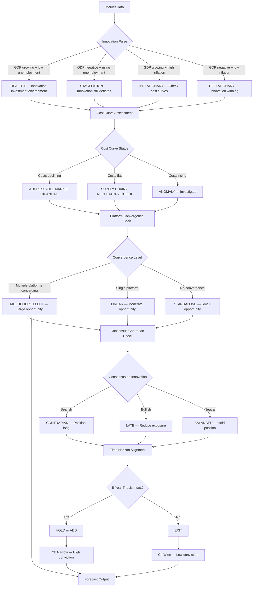

# Wood — Decision Flow

```mermaid
flowchart TD
    A[Market Data] --> B{Innovation Pulse}
    
    B -->|GDP growing + low unemployment| C[HEALTHY — Innovation investment environment]
    B -->|GDP negative + rising unemployment| D[STAGFLATION — Innovation still deflates]
    B -->|GDP growing + high inflation| E[INFLATIONARY — Check cost curves]
    B -->|GDP negative + low inflation| F[DEFLATIONARY — Innovation winning]
    
    C --> G[Cost Curve Assessment]
    D --> G
    E --> G
    F --> G
    
    G --> H{Cost Curve Status}
    H -->|Costs declining| I[ADDRESSABLE MARKET EXPANDING]
    H -->|Costs flat| J[SUPPLY CHAIN / REGULATORY CHECK]
    H -->|Costs rising| K[ANOMALY — Investigate]
    
    I --> L[Platform Convergence Scan]
    J --> L
    K --> L
    
    L --> M{Convergence Level}
    M -->|Multiple platforms converging| N[MULTIPLIER EFFECT — Large opportunity]
    M -->|Single platform| O[LINEAR — Moderate opportunity]
    M -->|No convergence| P[STANDALONE — Small opportunity]
    
    N --> Q[Consensus Contrarian Check]
    O --> Q
    P --> Q
    
    Q --> R{Consensus on Innovation}
    R -->|Bearish| S[CONTRARIAN — Position long]
    R -->|Bullish| T[LATE — Reduce exposure]
    R -->|Neutral| U[BALANCED — Hold position]
    
    S --> V[Time Horizon Alignment]
    T --> V
    U --> V
    
    V --> W{5-Year Thesis Intact?}
    W -->|Yes| X[HOLD or ADD]
    W -->|No| Y[EXIT]
    
    X --> Z[CI: Narrow — High conviction]
    Y --> AA[CI: Wide — Low conviction]
    Z --> AB[Forecast Output]
    AA --> AB
    N --> AB
```
